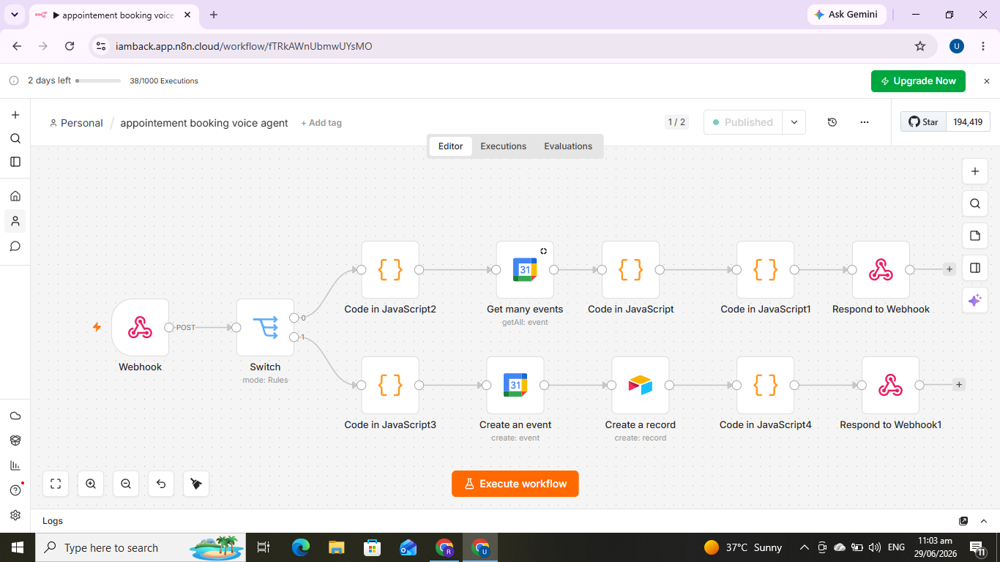

<p align="center">
  
</p>

<p align="center">
  
  
  
  
</p>

# AI Voice Appointment Booking Agent

A 24/7 voice AI receptionist that answers phone calls, checks live calendar
availability, and books appointments into Google Calendar and a database —
all through natural voice conversation.

Built for healthcare clinics (dental, physio, GP) that miss calls after hours,
but the architecture works for any appointment-based business.

### ▶️ (https://www.loom.com/share/4108e38636b34e0a9d1ed880b15c3086)

---

## What it does

A caller phones the clinic. An AI receptionist named **Sarah** answers, talks
like a real person, and handles the whole booking:

- Understands what service the caller wants
- Converts natural speech ("tomorrow", "next Tuesday at 2") into real dates
- Checks the calendar for that exact day before promising anything
- Collects the caller's name and phone number
- Books the appointment into Google Calendar and saves it to the database
- Confirms warmly and ends the call

If a slot is taken, it offers the nearest free time instead. It never claims
something is booked unless the booking actually succeeded.

---

## Architecture

The system splits responsibility between two layers — this is the core design
decision that makes it work in real time.

```
   Caller (phone / web)
          │  voice
          ▼
   ┌──────────────┐     VAPI = the BRAIN
   │     VAPI     │     • speech-to-text + text-to-speech
   │   "Sarah"    │     • holds the conversation
   │              │     • decides WHEN to call a tool
   └──────┬───────┘
          │  webhook (tool call: checkAvailability / bookAppointment)
          ▼
   ┌──────────────┐     n8n = the HANDS
   │     n8n      │     • reads / writes the calendar
   │  workflow    │     • saves to the database
   │              │     • returns a single-line answer to VAPI
   └──────┬───────┘
          │
     ┌────┴─────┬──────────────┐
     ▼          ▼              ▼
 Google     Airtable      (response
 Calendar   database       back to VAPI)
```

**Why this split?** Voice conversation needs sub-second responses. Putting a
reasoning model inside the automation layer is too slow for a live call. So
VAPI handles all the real-time thinking and voice, and n8n does the
mechanical work — look at the calendar, write the record, answer. Fast where
it needs to be fast, reliable where it needs to be reliable.

---


## How a booking flows through n8n

A single webhook receives every tool call from VAPI. A Switch node routes it
by tool name into one of two branches.

**Branch 1 — checkAvailability (read):**
1. Extract the requested date and time from the tool call
2. Read that day's events from Google Calendar
3. Decide free or busy
4. Format the answer in VAPI's required response shape
5. Respond to the webhook

**Branch 2 — bookAppointment (write):**
1. Extract name, phone, service, date, time
2. Create the event in Google Calendar
3. Save the appointment record to the database
4. Format the confirmation
5. Respond to the webhook

---

## Tech stack

| Layer | Tool |
|---|---|
| Voice + conversation | VAPI |
| Language model | Gemini Flash |
| Voice | Clara (VAPI) |
| Speech-to-text | Deepgram |
| Automation / orchestration | n8n |
| Calendar | Google Calendar API |
| Database | Airtable |

---

## Engineering details worth noting

A few real problems this solves under the hood:

- **Date grounding.** Voice models don't know today's date and will invent
  one. The system injects the live current date into the assistant's context
  so "tomorrow" resolves to the correct calendar date, with a server-side
  safety net that catches any bad date before it reaches the calendar.

- **Strict response contract.** VAPI only accepts a specific JSON shape
  (`results` array, matching `toolCallId`, single-line string, HTTP 200
  always). The workflow formats every reply to that contract so responses
  are never silently dropped.

- **Graceful failure.** If a tool errors, the assistant tells the caller
  there's a brief system issue and offers to take details — it never lies
  and says "booked" when the write failed.

- **Reusable template.** The assistant prompt is modular: swapping the clinic
  info and services block adapts it to any new business without touching the
  logic.

---

## Status

This is a working demo built end to end. The availability check and booking
flow both run live: VAPI holds the conversation, n8n reads and writes the
calendar and database, and the caller hears a real answer.

---

## About

Built by **Usman Farooq** — AI automation developer specializing in n8n,
AI agents, and WhatsApp/voice booking systems for healthcare clinics.

- LinkedIn: [linkedin.com/in/usman-rai](https://linkedin.com/in/usman-rai)
- GitHub: [github.com/Usman-rai](https://github.com/Usman-rai)
